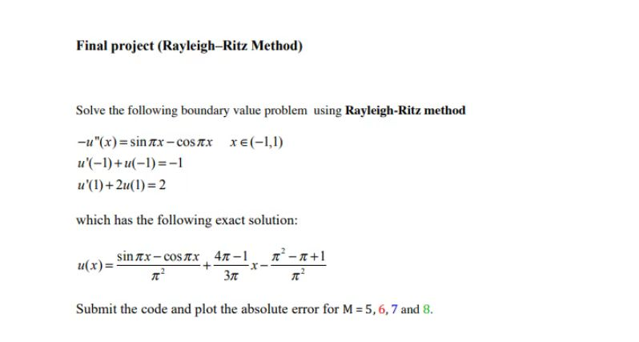
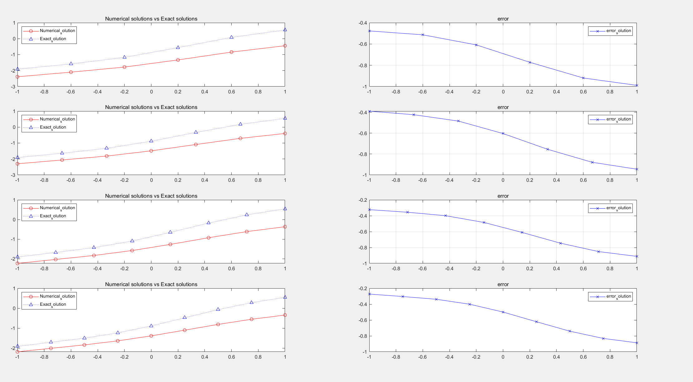
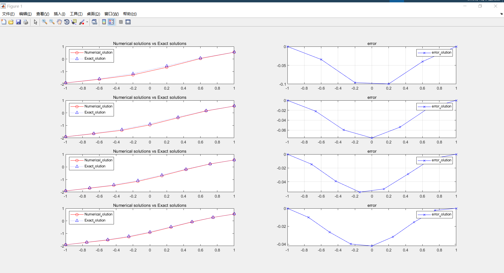

## Problem Description 

非齐次的三类边值条件的双边值问题

已知精确解，p=1 ,q=0,f=sinπx+cosπx 

从Ritz(有限元)法出发，使用Matlab编写代码解决该问题。

M: 区间大小

参考文献请见：两点边值问题的有限元算法_付小龙.pdf

基函数没有选择好 致使效果误差较大，如下图所示:

若将该问题转为经典的一类边值条件的双边值问题，则按照传统的Rizt解法 可得到如下:

